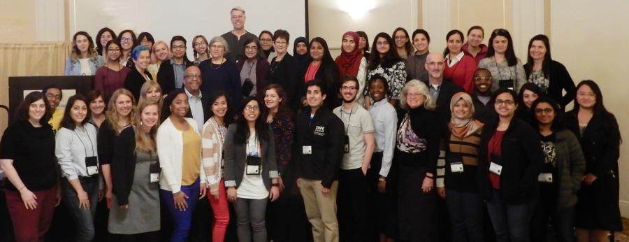

<!--  -->

GREPSEC is a workshop for early-stage graduate students in computer security and privacy, focusing on women and members of underrepresented populations.

# Program

The GREPSEC program will include research talks, mentoring, and social/networking sessions.

The relaxed (albeit virtual) nature of the workshop will give students time to talk informally with speakers about research opportunities and career paths. Speakers will be invited based on their accomplishments in research and their ability to mentor students from diverse backgrounds.

More details soon!

# Attending

### Accepted GREPSEC attendees will automatically qualify to receive a Diversity Grant to attend [USENIX Security ’21](https://www.usenix.org/conference/usenixsecurity21/).

Space is limited and an application is required of all potential attendees. Applications will be accepted starting in March 2021, and details will appear here. Applications will be due in early May.

# Organizers
_**General Chair**_
* [Michelle Mazurek](https://umiacs.umd.edu/~mmazurek), University of Maryland  

_**Program Chairs**_
* [Christina Garman](https://www.cs.purdue.edu/homes/clg/), Purdue University
* [Michel Kornegay](https://www.armmedlab.com), Morgan State University 

_**Steering Committee**_
* [Terry Benzel](http://isi.edu/people/tbenzel), USC Information Sciences Institute
* [Susan Landau](http://privacyink.org/), Tufts University
* [Hilarie Orman](http://www.purplestreak.com/), Purple Streak

<!-- | **General Chair** | |
| --- | --- |
| Michelle Mazurek | University of Maryland |

|**Program Chairs**| |
| --- | --- |
| Christina Garman | Purdue University |
| Michel Kornegay | Morgan State University |

|**Steering Committee**|  |
| --- | --- |
|[Terry Benzel](http://isi.edu/people/tbenzel) | USC Information Sciences Institute |
|[Susan Landau](http://privacyink.org/) | Tufts University |
|[Hilarie Orman](http://www.purplestreak.com/) | Purple Streak | -->

# Previous workshops

*  [GREPSEC IV](https://www.ieee-security.org/grepsec/index-gs4.html)
*  [GREPSEC III](https://www.ieee-security.org/grepsec/index-gs3.html)
*  [GREPSEC II](https://www.ieee-security.org/grepsec/grepsec2)
*  [GREPSEC I](https://www.ieee-security.org/grepsec/grepsec1/)

* * *
GREPSEC V will be held in cooperation with [USENIX](https://usenix.org) and is sponsored by the [NSF](https://nsf.gov).

###### Made with [Hacker](https://pages-themes.github.io/hacker/) theme for Github Pages
