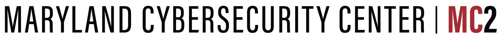

<!-- To test locally: bundle exec jekyll serve; check localhost:4000 -->
<!-- To publish, commit and push -->

<!--  -->

GREPSEC is a workshop for early-stage graduate students in computer security and privacy, focusing on underrepresented populations, including women, non-binary, and gender minorities; Black, Hispanic/Latino/Latina, Native American and Indigenous students; and LGBTQ+ students.

 
# Program

The GREPSEC program will include research talks, mentoring, and social/networking sessions.

The relaxed (albeit virtual) nature of the workshop will give students time to talk informally with speakers about research opportunities and career paths. Speakers will be invited based on their accomplishments in research and their ability to mentor students from diverse backgrounds.

[Program](./program.md)

 
# Attending

**Apply [here](https://go.umd.edu/grepsecV-apply). Applications are due on**  ̶M̶a̶y̶ ̶4̶ ̶ **May 11 (deadline extended).**

GREPSEC will be held virtually this year.  There is **NO COST** for attendees.

#### Accepted GREPSEC attendees will automatically qualify to receive a Diversity Grant to attend [USENIX Security ’21](https://www.usenix.org/conference/usenixsecurity21/).
GREPSEC is scheduled for the Friday before USENIX Security in order to allow attendees to network before attending the conference and other associated events, such as SOUPS and workshops.

Space is limited and an application is required of all potential attendees. Strong preference is given to applicants who are actively doing research (toward eventual publication) in security and privacy.

 
# Organizers
_**General Chair**_
* [Michelle Mazurek](https://umiacs.umd.edu/~mmazurek), University of Maryland  

_**Program Chairs**_
* [Christina Garman](https://www.cs.purdue.edu/homes/clg/), Purdue University
* [Michel Kornegay](https://www.armmedlab.com), Morgan State University 

_**Steering Committee**_
* [Terry Benzel](http://isi.edu/people/tbenzel), USC Information Sciences Institute
* [Susan Landau](http://privacyink.org/), Tufts University
* [Hilarie Orman](http://www.purplestreak.com/), Purple Streak

<!-- | **General Chair** | |
| --- | --- |
| Michelle Mazurek | University of Maryland |

|**Program Chairs**| |
| --- | --- |
| Christina Garman | Purdue University |
| Michel Kornegay | Morgan State University |

|**Steering Committee**|  |
| --- | --- |
|[Terry Benzel](http://isi.edu/people/tbenzel) | USC Information Sciences Institute |
|[Susan Landau](http://privacyink.org/) | Tufts University |
|[Hilarie Orman](http://www.purplestreak.com/) | Purple Streak | -->

 
# Previous workshops

*  [GREPSEC IV](https://www.ieee-security.org/grepsec/index-gs4.html)
*  [GREPSEC III](https://www.ieee-security.org/grepsec/index-gs3.html)
*  [GREPSEC II](https://www.ieee-security.org/grepsec/grepsec2)
*  [GREPSEC I](https://www.ieee-security.org/grepsec/grepsec1/)

* * *
GREPSEC V will be held in cooperation with [USENIX](https://usenix.org) and is sponsored by the [NSF](https://nsf.gov).

We thank our Gold sponsors: [Microsoft](https://www.microsoft.com), the [National Security Agency]() and [USENIX](https://usenix.org).

{: width="250" }
{:width="110"}
{:width="110"}
{: width="230"}

We thank our Bronze sponsor: [The Maryland Cybersecurity Center](https://cyber.umd.edu).

{:width="300"}

###### Made with [Hacker](https://pages-themes.github.io/hacker/) theme for Github Pages
